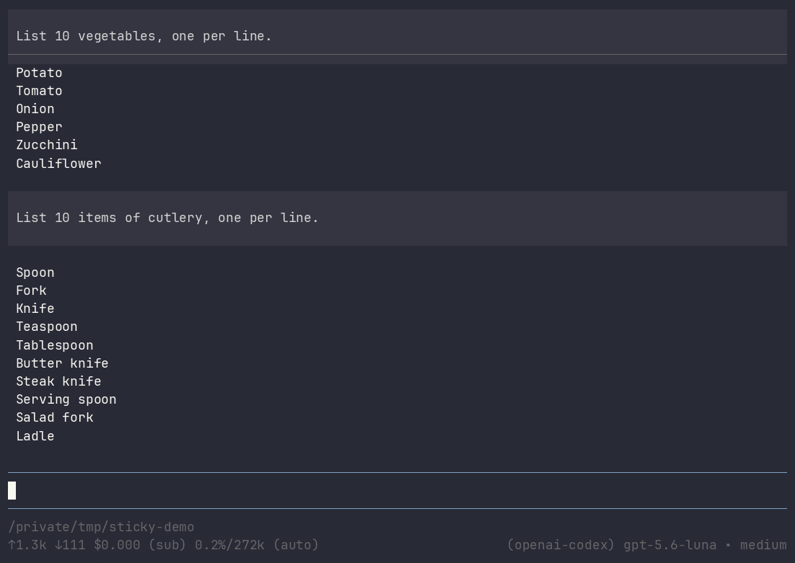
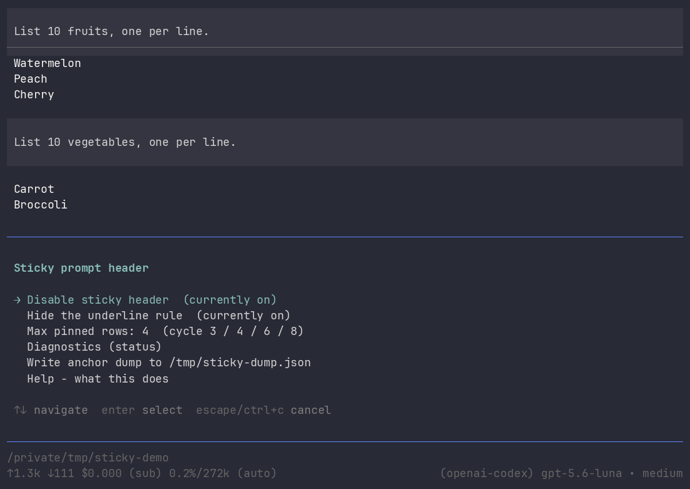
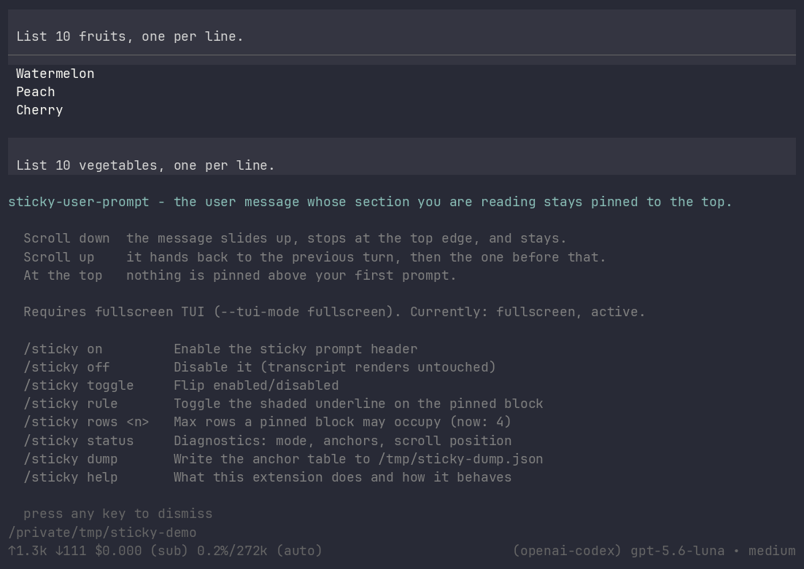

<div align="center">

# 📌 sticky-user-prompt

**Never lose track of what you asked.**

The user message whose answer you are reading stays pinned to the top of the transcript —
it slides up, stops at the edge, and hands over to the previous turn as you scroll back.

[](LICENSE)
[](https://github.com/earendil-works/pi)
[](#-requirements)



</div>

---

## The problem

You ask a long question. The model answers at length. Thirty seconds later you are staring at
paragraph nine of the reply with no idea which of your three questions it belongs to — so you
scroll all the way up, find your prompt, and scroll all the way back down.

## The fix

Your transcript is really a stack of **sections**: each prompt opens one, and it runs until the
next prompt. This extension pins the header of whichever section you are currently reading —
exactly like sticky headers in a well-behaved list.

<div align="center">


</div>

| Where you are | What is pinned |
| --- | --- |
| Reading turn N's answer | **turn N's prompt** |
| Scrolled up into turn N-1 | **turn N-1's prompt** |
| Scrolled up into turn N-2 | **turn N-2's prompt** |
| Above your very first prompt | nothing |

Scrolling up walks the header **backwards through your prompt history**. Scrolling down walks it
forward again. It is a continuous readout of *"which question am I reading the answer to?"* —
not a popup of the latest prompt.

### It moves like real sticky positioning

The pinned block is not a summary or a lookalike. It is **the same rendered message component**
from your transcript — same background, same padding, same colours — revealed row by row as it
scrolls off:

- **Sliding in.** The message rises to the top edge and *stops*. Pinned rows always equal the rows
  that scrolled off, so there is no duplicate, no gap, and nothing jumps.
- **Handing over.** When the next prompt approaches the top, it *pushes* the pinned one up and out
  a row at a time. The handover costs zero jump.
- **Too tall?** A long prompt is capped (4 rows by default) and marked with a `…` right after the
  last visible word.

---

## ⚡ Requirements

> [!IMPORTANT]
> **This needs pi's fullscreen TUI: `pi --tui-mode fullscreen`.**
>
> In regular mode pi renders into normal terminal scrollback — your terminal owns those top rows,
> not pi, so *no* extension can pin anything there. In regular mode this one degrades gracefully to
> a strip above the editor while the model is streaming.

Make it permanent in `~/.pi/agent/settings.json`:

```json
{ "tuiMode": "fullscreen" }
```

or flip it live from `/settings`. Fullscreen also gives you an independently scrollable transcript
and draggable scrollbars; the trade is that pi owns the viewport, so your terminal's own scrollback
no longer applies to the transcript.

## 📦 Install

```bash
pi install git:github.com/ajanderson1/pi-sticky-user-prompt
```

<details>
<summary>Or install manually</summary>

```bash
git clone https://github.com/ajanderson1/pi-sticky-user-prompt.git
ln -s "$PWD/pi-sticky-user-prompt/extensions/sticky-user-prompt" \
      ~/.pi/agent/extensions/sticky-user-prompt
```

Extensions in `~/.pi/agent/extensions/*/index.ts` are auto-discovered — no build step, no
dependencies. Restart pi and it is live.

</details>

Then start pi in fullscreen and scroll:

```bash
pi --tui-mode fullscreen
```

## 🎛 Options

Run `/sticky` bare for an interactive menu, or type `/sticky ` and let pi's autocomplete remind you.

<div align="center">



</div>

| Command | What it does |
| --- | --- |
| `/sticky` | Options menu (toggle, rule, row cap, diagnostics, help) |
| `/sticky on` · `off` · `toggle` | Enable or disable the pinned header |
| `/sticky rule` | Toggle the shaded underline on the pinned block |
| `/sticky rows <n>` | Max rows a pinned block may occupy (default `4`) |
| `/sticky status` | Diagnostics: mode, anchor count, scroll position |
| `/sticky dump` | Write the anchor table to `/tmp/sticky-dump.json` |
| `/sticky help` | What it does and how it behaves |

<div align="center">



</div>

---

## 🔍 How it works

Every frame, the extension asks one question: *which message owns the top of the viewport?*

1. **Measure.** It walks the rendered transcript and records the line offset of every user message.
   Leaf components cache their render per `(text, width)`, and pi's `ScrollView` already renders the
   whole document each frame, so this is a second pass over work pi has done anyway — microseconds,
   and only when the width or content height actually changes.
2. **Select.** A binary search finds the last message whose first line has reached the top edge.
3. **Reveal.** It renders exactly the rows of that message which have scrolled off, capped by the
   row limit and by the distance to the next message.

Because the pinned height always equals the document rows consumed, the pinned rows and the rows
still scrolling stay one contiguous run. That is what makes the motion continuous.

Anchors are rebuilt from the rendered document rather than tracked incrementally, so `/compact`,
`/tree` navigation, terminal resizes, and **resumed sessions** all just work — a session you reopen
has its full prompt history pinnable immediately.

### Honest trade-offs

- The pinned block sits *outside* the scroll box, so it borrows rows from the viewport. Continuous
  message motion and a constant scroll rate are mutually exclusive; this picks continuity, which
  means the transcript pauses for a few notches while a block pins in, and advances at double rate
  during a handover. No jumps anywhere.
- It reaches into three pi internals — `TuiAltScreen.prototype.setLayoutRoot` (to own the top row),
  `ScrollView.child` (to reach the document), and `UserMessageComponent` (to find section
  boundaries). Each is guarded: if pi's shape changes, the extension falls back to the
  above-the-editor strip instead of crashing.

## 🛠 Development

The demo is fully reproducible. It boots an isolated pi (its own `PI_CODING_AGENT_DIR` with only
this extension loaded), replays a pre-seeded session so no model calls happen on camera, drives the
TUI through tmux, and renders the GIF, MP4, and stills:

```bash
./assets/demos/record.sh          # cast -> gif -> mp4
./assets/demos/shot.sh <pane> x.png   # pixel-exact screenshot of a live pane
```

## 📄 License

MIT © AJ Anderson — see [LICENSE](LICENSE).
